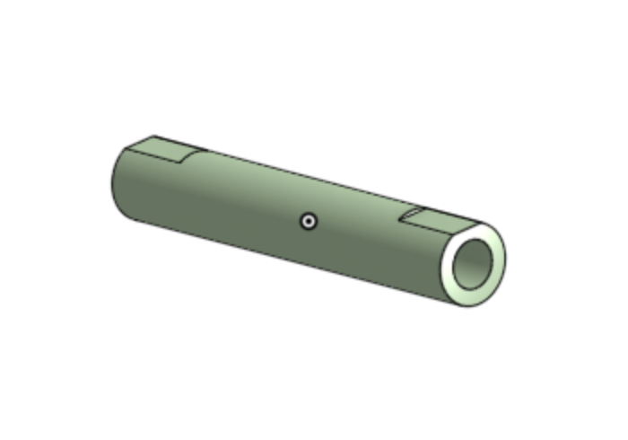

# Basic Onshape CAD Assignments
Onshape CAD Assignments

## Caster

### Base

Onshape File : [Base](https://cvilleschools.onshape.com/documents/5c1d5796c9098d60ababfaa2/w/21b145938ec824bba0ea0ab5/e/f4dd323e01a533a46330e82d)

This was a pretty easy piece to make. Onshape seems pretty powerful and fast considering it runs in your browser. 

### Mount

Onshape File : [Mount](https://cvilleschools.onshape.com/documents/5c1d5796c9098d60ababfaa2/w/21b145938ec824bba0ea0ab5/e/f4cf04ea7740b96509d1af12)

It was interesting to see how there are many different ways that you can make a peice and stil end up with the same result. My prefered method is to create one sketch that contains the rectangle along with the 5 holes, and then just extrude the space in between. 

### Fork

Onshape File : [Fork](https://cvilleschools.onshape.com/documents/5c1d5796c9098d60ababfaa2/w/21b145938ec824bba0ea0ab5/e/7e83d911f09a628e41580c23)

This piece was the first major test of my Onshape skills, so it took a bit more time. Luckily, Onshape is pretty intuitive and makes tasks like mirroring objects really easy to do. 

### Tire

Onshape File : [Tire](https://cvilleschools.onshape.com/documents/5c1d5796c9098d60ababfaa2/w/21b145938ec824bba0ea0ab5/e/1afb94cdd5ba7c081ca68a40)

This was my first time making a revolved feature in Onshape. It's pretty much the same as it is in SolidWorks. 

### Wheel

Onshape File : [Wheel](https://cvilleschools.onshape.com/documents/5c1d5796c9098d60ababfaa2/w/21b145938ec824bba0ea0ab5/e/e49b64c35611a617ad5141a8)

This piece was another revolved feature which made the process to make it was pretty similar to the tire. I like how that when selecting edges to fillet, you can just select a face and it will fillet all of the edges connected to that face. It saves you the time of having to go through and manually select each edge that you want to fillet. 

### Axle, Collar, Bearings

Onshape File: Axle : [Axle](https://cvilleschools.onshape.com/documents/5c1d5796c9098d60ababfaa2/w/21b145938ec824bba0ea0ab5/e/7950579751d92902e5faeceb)

Onshape File: Collar : [Collar](https://cvilleschools.onshape.com/documents/5c1d5796c9098d60ababfaa2/w/21b145938ec824bba0ea0ab5/e/5286deb87063eb8b74591380)

Onshape File: Bearing : [Bearing](https://cvilleschools.onshape.com/documents/5c1d5796c9098d60ababfaa2/w/21b145938ec824bba0ea0ab5/e/6eeca187b3c6474cb5249c92)

All three of these pieces were super simple. The bearing was made in only one feature, while the collar was made in 2 features. The axle was a cylinder extruded symmetrically with small "D" cuts on each end. 

### Assembly

Onshape File: [Assembly](https://cvilleschools.onshape.com/documents/5c1d5796c9098d60ababfaa2/w/21b145938ec824bba0ea0ab5/e/8579945a5a2e60473edd15c9)

Assembling things in Onshape is a lot easier then it is in SolidWorks. A lot of components can be mated together and fully contstrained with just one mate. In a different CAD program like SolidWorks, it might take 2-3 mates to complete the same task. 

## Dowel Pin Configurations Assignment

In this assignment we used Onshape configurations to create many different types of dowel pins and then used them to create a picture frame assembly. 

### Dowel Pins

So far, my favorite feature of Onshape has been how easy it is to make configurations. Configurations in Soldiworks worked well, but sometimes there would be weird errors and other mishaps that I wouldn't be able to figure out. Configurations in Onshape are super easy. I like how that when creating a configuration, you just have to go and click on the feature/sketch that you want to manipulate. 

### Picture Frame

### Final Assembly

